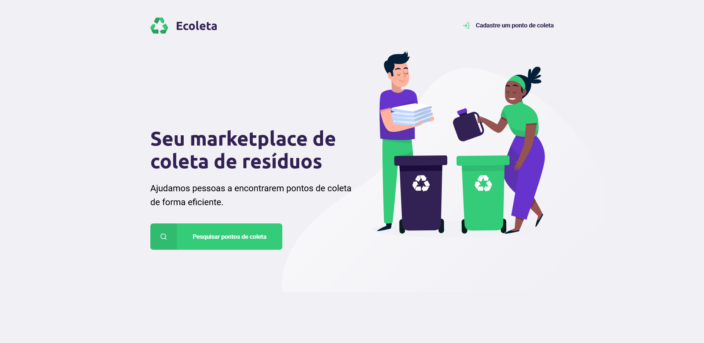
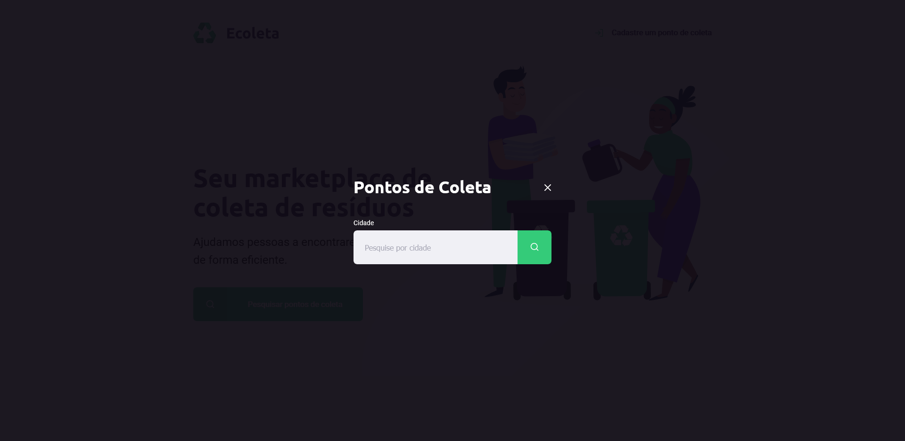
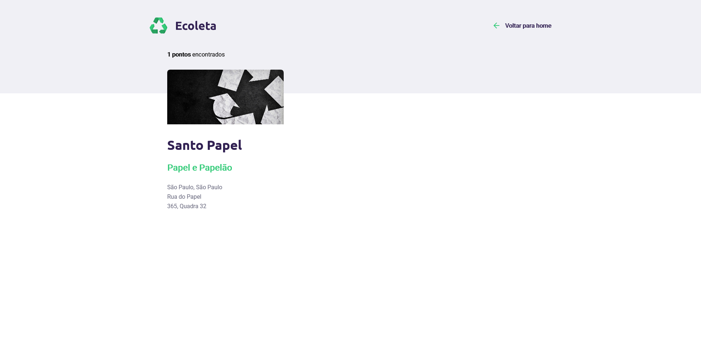
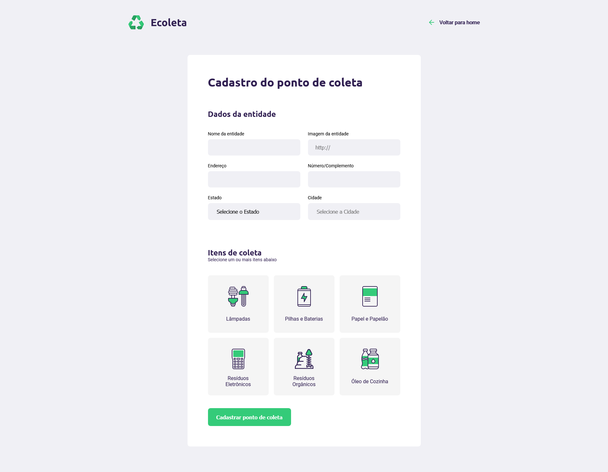

# 
## Criado durante o evento Next Level Week #1 - na Trilha Starter, ocorrido na primeira semana de Junho de 2020, e ministrado pela [Rocketseat](https://rocketseat.com.br/)

## Sobre:

Esse projeto foi idealizado para servir como gerenciador de coletas de resíduos de forma eficaz. O objetivo é conectar pessoas e empresas que coletam resíduos como lâmpadas, baterias, óleo de cozinha, papéis , papelão, etc.

 

---

## Tecnologias do projeto:

* **HTML5**
* **CSS3**
* **JS**
  * **Com uso da [API](https://servicodados.ibge.gov.br/api/docs/localidades) do IBGE**
* **Node.js**
  * **Com express, nodemon e nunjucks**
* **SQLite3**

---

## Como ver e usar o projeto na sua máquina:

  Clone o repositório em sua máquina
  `git clone https://github.com/Hitnnan/nextlevelweek-ecoleta-starter.git`

  Baixe e instale o *Node.JS*
  `https://nodejs.org/`

  Instale as dependências do projeto
  `npm install`

  Inicie o servidor, digitando em seu terminal:
  `npm start`

  Acesse seu navegador na porta 3000
  `localhost:3000`

---

### Instrutor: [Mayk Brito](https://github.com/maykbrito)
---
***</>*** **by [hitnnan](https://github.com/hitnnan)**
